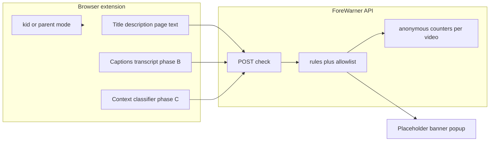

# Click-warning filter — roadmap (owner notes)

Last updated: 2026-07-04 (owner decisions added)

**Status:** **Roadmap only** — separate Odd Trove project. No build until you approve.

**Product name:** **ForeWarner** (owner-chosen 2026-07-04)

**Working folder:** `clickWarning/` (repo slug until a public URL is chosen — e.g. `/forewarner/`)

**What this is:** A **separate product** from [CleanScreen](../cleanscreen/www/index.html). CleanScreen is **filtered web search**. This is **warn before watch or read** on Netflix, YouTube, news video, articles, and similar.

**What CleanScreen is for here:** A **reference example** for the *kind of content you want warned about* (Halalit-aligned lines — not a codebase to live inside, not a shared API you must use).

**One-line pitch:** **ForeWarner** — warn as early as practical when someone is about to watch or read something that crosses your content lines. Not a search engine; not part of CleanScreen.

**Audience (when built):** Whole **family on one browser** — separate **kid** vs **parent** mode/account if possible. Owner-only beta on Odd Trove first, then wider when trusted.

---

## Owner decisions (2026-07-04)

### 1. Kid vs parent (family browser)

- **Kid mode:** Default. Warnings stick — **no “Continue anyway.”**
- **Parent mode:** Parent enters **PIN** → Continue anyway and overrides unlocked.
- **Auto-lock:** After **idle** (no browsing activity for N minutes — pick at build, e.g. 5–15), ForeWarner **drops back to kid mode**. Parent must enter PIN again to re-enter parent mode.
- **One kid lock** for the **whole browser** (owner decision) — not separate profiles per child.
- **PIN standard:** Treat like a **credit-card-code-level parent gate** (owner wording). No money involved; the point is that kids should not be able to casually guess, reset, inspect, or bypass it.
  - No plain-text PIN storage.
  - **Wrong guesses:** Slow down repeat guessing so kids can’t brute-force — but **parents must not get stuck locked out** after an honest mistake. Roadmap intent: short cooldown or gentle cap, then try again; **no long lockout** for parent PIN entry. Harsher limits only on **PIN reset / change**, not everyday unlock.
  - Parent reset must be hard for **kids** to hijack — not “make any junk email and reset it.” Recovery for a **real parent** should stay straightforward (see below).
  - Do not expose parent mode through a normal extension popup control without the PIN.
- **Parent gate setup (still thinking — owner clarification):**
  - **Daily parent mode = PIN only.** “Continue anyway” unlocks with PIN, not with email login. Kids with junk emails must **not** be able to enter parent mode that way.
  - Owner is unsure whether **creating / resetting the PIN** should require a **junk-email ForeWarner account** (one-time setup on the parent’s machine). Concern: if setup is just “make any account,” a kid could make a junk email too and hijack setup.
  - **Roadmap-safe approach when built:** First PIN set on install with **no kid present** (or Chrome profile owner step); optional junk-email account **only** for owner stats dashboard / lost-PIN recovery on Odd Trove — **never** as the everyday bypass. If email is used at setup, require **existing parent PIN** or **OS/browser profile owner** to change it, not email alone from the extension popup.
  - **Decision still open:** email required at first PIN setup, or local PIN only with email optional later?
  - **Parent recovery (owner decision):** Wrong PIN on unlock → **easy retry**, not a long ban. Forgot PIN entirely → recovery path for **you** only (e.g. Odd Trove owner email / one-time link on junk account set at install) — still kid-hard, parent-doable.

### 2. Where warnings show

| Surface | UX |
|---------|-----|
| **Video (YouTube, Netflix tiles, etc.)** | Replace thumbnail with ForeWarner placeholder (unavailable-style tile); confirm on click/play. |
| **Reading (articles, pages)** | **Warning popup** (modal) on flagged pages — can't be missed. Owner prefers this over a top banner (banner is easy to scroll past). Optional small badge after dismiss. |

### 3. Exceptions and context (not blunt keyword bans)

- **Most channels are not “always OK.”** Rare hand exceptions only — owner named **Yaqeen Institute** as one.
- **Anti-racism / reporting on oppression** (racism shown as wrong, not endorsed) → **should not warn** the same as pro-racism or demonization.
- Same spirit for **substances:** warn on **promotion**; content about **avoiding** drugs/alcohol/tobacco (education, recovery, “don’t vape”) → **should not warn** like active promotion.
- **Owner aspiration:** ForeWarner should judge **what the video actually says**, not just the title — via **transcript / captions**, and ideally by “watching” or pre-processing audio into text **before** the family opens it.

**Honest phasing for #3 (Cursor in this agent):**

| Phase | What | Verdict |
|-------|------|---------|
| **A (first build)** | Title, description, channel, visible page text | **Feasible with tradeoffs** |
| **B** | Fetch **existing** captions/transcript when the platform exposes them (YouTube often; Netflix hard) | **Feasible with tradeoffs** — latency, missing captions |
| **C** | **Transcript classifier API** (owner decision) — caption text → labels (warn / OK / reason); **not** generating prose | **Feasible with tradeoffs** — provider must allow no-training / minimal retention; costs per check |
| **D** | Pre-watch every video and auto-transcribe before anyone clicks | **Not feasible at scale** for v1 — cost, delay, rights; maybe **after click, before play** on one title, not the whole feed |

Regex alone will **not** meet the anti-racism / substance-nuance bar — plan for phase B + C.

### 4. Substances

- **Warn:** active promotion (buy beer, vape deals, cocktail culture push, etc.).
- **Do not warn (same bucket as anti-racism policy):** talking about harm, avoidance, recovery, “say no to drugs” framing.

### 5. Privacy and anonymous stats (Halalit-style — owner decisions 2026-07-04)

**Never store:**
- Who checked what (no names, emails, accounts tied to checks)
- Per-person viewing history
- Long-lived IP or device fingerprints in the stats database

**OK — anonymous aggregates only** (so you can tune false OK / false warn):

Per **video or page key** (e.g. YouTube `videoId`, stable URL hash — not a person):

| Counter | What it tells you |
|---------|-------------------|
| `checks` | How many times ForeWarner ran a check on this item |
| `result_ok` | How many times the answer was **allow / OK** |
| `result_warn` | How many times the answer was **warn / not OK** |

**Spotting wrong labels** (still no personal info):

| Counter | Meaning |
|---------|---------|
| `feedback_false_alarm` | Parent chose **“ForeWarner wrong — should be OK”** (warned when it shouldn’t) |
| `feedback_missed` | Parent chose **“ForeWarner wrong — should have warned”** (OK when it shouldn’t) |

- Feedback buttons **parent mode only** (after PIN), optional on popup — one tap, no comment required for the count.
- Rate-limit per browser session so one person can’t spam; **do not** write rate-limit keys into the long-term stats table as identity.
- Owner dashboard (later): “this video: 400 checks, 380 OK, 20 warn, 15 false-alarm reports” — tune rules or allowlist, still **no who**.

**Check payload:** Server needs title/url/transcript **for that request** to classify; do **not** append identity to that row in analytics — only bump the anonymous counters above.

**No separate marketing database** of users; no cross-user reading of viewing history.

### 6. Netflix and streaming — per title, not whole site

- **Not** “Netflix is iffy, reject everything” for **Netflix** — **per show / episode / film**; some titles better, some worse.
- **Disney+ and Max (HBO):** Owner decision — ForeWarner **does not recommend** these services and **will not participate** on those sites (no per-title hooks). Extension shows a clear line like **“ForeWarner does not recommend Disney+ / Max and does not check content there”** if user visits; no pretend partial coverage. Same content **lines** apply elsewhere where ForeWarner does participate (YouTube, Netflix, reading, etc.).
- Other streamers (TikTok, Instagram Reels, etc.): **same rules eventually** — order after YouTube / Netflix / reading; not v1.

### 7. Languages (owner decision)

- **Goal:** All languages **from the start** where the **transcript classifier API** (and caption fetch) can handle them — not English-only forever.
- **Honesty:** Hand-written regex lists are English-heavy; multilingual quality depends on **API reliability** for each language. Phase A metadata may be weaker in non-English until phase B/C; owner accepts that tradeoff if API is good enough.

### 8. LGBTQ — context-aware (owner decision 2026-07-04)

**Must be context-aware** — not “any mention warns.” Transcript classifier (phase C) judges **intent**, like anti-racism.

| Warn | Do not warn (same spirit as reporting / education) |
|------|-----------------------------------------------------|
| **Promotes** LGBTQ (celebration, advocacy push, romance storylines, identity-as-hero arc, etc.) | Neutral **news or health** that mentions LGBTQ people without promoting or demonizing |
| **Actively demonizes** LGBTQ people | **Reports** on oppression or discrimination without endorsing hate |
| **Peculiar / ideological framing** owner called out — e.g. “LGBTQ is in nature,” naturalistic or pseudo-science arguments used to **normalize or push** the topic | Plain factual mention in passing in an otherwise OK piece (classifier must still be conservative — false OK goes to parent feedback counts) |

**Examples owner gave:** “LGBTQ in nature” style content → **warn**. Promotion or active demonization → **warn**. Factual reporting without promote/demonize → **should not warn** (classifier job).

**Not keyword-only:** Phase A regex may over-flag; phase C classifier owns this policy.

### 9. Honesty when ForeWarner cannot check 100% (owner decision)

ForeWarner must **say so out loud** in the UI — never imply full coverage.

**When check is partial or uncertain**, placeholder / popup includes lines like:

- “**Includes [category]** — e.g. LGBTQ themes, strong language, substance talk…” (whatever was detected or suspected from metadata/captions)
- “**ForeWarner cannot check 100%**” — e.g. no captions, visual fanservice not scanned, classifier not confident, only title checked

| Situation | User-facing honesty |
|-----------|---------------------|
| Title-only check (no transcript yet) | “Checked title/description only — ForeWarner cannot check 100%” |
| Captions missing | “No transcript available — ForeWarner cannot check 100%” |
| Visual / thumbnail not analyzed | “Does not analyze video images — ForeWarner cannot check 100%” |
| Classifier low confidence | “Uncertain — includes such-and-such; ForeWarner cannot check 100%” + warn or soft-warn per policy |
| Disney+ / Max (no participation) | “ForeWarner does not recommend this service and does not check content here” |

Still show **Go back** (kid) or **Go back / Continue anyway** (parent) where applicable — honesty is additive, not hidden.

---

## Relationship to CleanScreen

| | **CleanScreen** | **Click-warning (this project)** |
|--|-----------------|----------------------------------|
| Job | Filter **search results** | Warn **before play / click / read** |
| Where it runs | Odd Trove web page | Browser extension (likely) + own backend |
| Rules | [`cleanscreen_filter.py`](../cleanscreen/cleanscreen_filter.py) | **Own rule module** when built — lists may be *inspired by* CleanScreen, maintained **separately** |
| Product | Shipped owner beta | Roadmap only |

**Note:** Early spike code under `cleanscreen/extension/click-warning/` and `POST /cleanscreen/api/check` was exploratory and is **not** this product. Ignore or remove in a later cleanup — do not treat CleanScreen as the home for this work.

---

## What you want it to warn about (owner list)

Applies across **Netflix films/episodes/series, YouTube videos/channels, news video, articles/pages you read, and similar**.

| If the content… | Owner wants a warning |
|-----------------|----------------------|
| Swears | Yes |
| Uses words relating to **private parts** (anatomy / body-part language) | Yes — **regardless of intended age group** (kids’ “body science” included) |
| Has LGBTQ content | **Context-aware** — warn on **promotion**, **active demonization**, or peculiar push (e.g. “LGBTQ in nature”); not on neutral news/health reporting alone |
| Has immodest fanservice | Yes |
| Demonizes a group (not the same as reporting on real oppression) | Yes |
| Says racist things, even if the video is not mainly about that politics | Yes |
| Uses crass non-swear words tied to sex (e.g. “sexy” as a joke, flirtation, innuendo) | Yes |
| Has adult romance or explicit sexual content | Yes |
| **Promotes** alcohol, tobacco, vape, etc. | Yes |
| Discusses racism/substances to **condemn, avoid, or report** (not endorse) | **No** — should not warn like promotion/hate |

**Phasing:** Line items above apply fully only when ForeWarner has enough **text** (metadata → captions → nuanced classifier). Early builds catch obvious metadata only; owner knows gaps until phase B/C.

---

## Content rules — roadmap map (honest feasibility)

Reference column: what **similar** checks exist in CleanScreen’s filter today (for comparison only — this project gets its **own** lists when built).

| Concern | CleanScreen-like reference (text only) | Gap for this project |
|---------|----------------------------------------|----------------------|
| **Swearing** | Profanity regexes | Captions/transcript for dialogue **inside** video |
| **Private-parts language** | Partial slang only; no full anatomy list | Dedicated anatomical word list; **no age-rating bypass**; captions for dialogue; visible text when reading |
| **LGBTQ content** | Context-aware via classifier (phase C) | Promotion, demonization, “in nature”-style push; not bare factual reporting |
| **Immodest fanservice** | Limited keywords | Cannot see outfits/poses; visual fanservice mostly missed |
| **Group demonization vs reporting** | Blunt hate phrases only | Cannot reliably separate journalism from hate with regex |
| **Incidental racist lines** | Only if phrases appear in available text | Needs transcript or human vet |
| **Crass sexual language (non-swear)** | Partial | Expand innuendo list; captions later |
| **Adult romance / explicit** | Romance/sexual keyword patterns | In-video content needs captions or vet |

**Verdict:** Cursor can help **design rules and a browser extension** later — **Feasible with tradeoffs**. Cursor **cannot** promise full in-video detection without captions/transcript or manual allowlists.

---

## Platforms

| Platform | Roadmap intent | Honest note |
|----------|----------------|-------------|
| **YouTube** | **Replace thumbnail** with ForeWarner placeholder when metadata fails; confirm on click/play | Best first target — public titles/descriptions |
| **Netflix** | **Per title** placeholder/warn — never whole-site block | Episode/show metadata + later captions |
| **Disney+ / Max** | **No participation** — clear “does not recommend / does not check here” | Owner choice; not blind per-title on those sites |
| **News video** | Warn on clip title/description/transcript | Text-only unless captions added |
| **Reading (articles, pages)** | **Warning popup** (modal) on flagged pages — can't be missed | Extension on general web |
| **Other streaming** | Same content lines everywhere | Extension + text/captions; no “watch the stream” magic |

---

## Delivery ideas (from planning — not committed)

| Idea | Feasibility |
|------|-------------|
| **Replace thumbnail** with ForeWarner placeholder (unavailable-style tile) | **Feasible with tradeoffs** — extension DOM overlay on YouTube; primary UX |
| Browser extension — click / pre-play confirm | **Feasible with tradeoffs** |
| Browser extension — general link / read warning | **Feasible with tradeoffs** |
| Own check API on Odd Trove (separate from CleanScreen) | **Feasible now** when approved |
| Warn without extension on arbitrary sites | **Not feasible** |
| **Analyzing** thumbnail *images* for content | **Not feasible** (early phases) — placeholder is from **text rules**, not image ML |
| Public / store ship | **Not yet** |

---

## Warning UX (owner vision)

### Video — thumbnail placeholder

When ForeWarner flags from available text, **replace the normal thumbnail** with a **ForeWarner placeholder** — same *idea* as YouTube’s gray **“Video unavailable”** tile: no enticing preview, calm ForeWarner styling.

| State | What the user sees |
|-------|-------------------|
| **Flagged (kid mode)** | Placeholder + reason + honesty line if not 100% checked. Click → **Go back** only. |
| **Flagged (parent mode)** | Same; click → **Go back** / **Continue anyway**. |
| **Partial check** | Still warn or caution as policy dictates, but copy **must** say what was detected and **“ForeWarner cannot check 100%”** when coverage is incomplete. |
| **Not flagged / check pending** | Normal thumbnail until check returns. |
| **Check failed (offline, API down)** | Normal thumbnail — **fail open**; optional badge in extension popup. |

### Reading — warning popup (not a banner)

- **Warning popup / modal** on entry to a flagged page — center of screen, must be acknowledged so it **can't be missed** (owner preference over a top banner, which is easy to scroll past).
- **Kid mode:** popup offers **Go back** only.
- **Parent mode:** popup offers **Go back** / **Continue anyway**; after dismiss, optional small ForeWarner badge stays as a reminder.
- Calm, intentional styling — clearly a safety warning, not a dark-pattern ad.

**Not this (early phases):** Scanning thumbnail **images** for immodesty — text/captions first.

---

## Out of scope (early phases)

- Pre-transcribing **every** video in the feed before anyone scrolls
- Perfect hate-vs-reporting judgment **with regex only**
- Image/thumbnail ML for immodesty
- Public launch before owner beta trust
- Halalit shelf / Book Quest coupling
- Whole-site blocks (Netflix, YouTube, etc.)

### Build phases (when approved)

1. **Metadata + kid/parent modes** — placeholder, banner, popup; Yaqeen-style tiny allowlist.
2. **Captions/transcript** when platform provides them (YouTube first).
3. **Transcript classifier API** — promotion vs prevention; reporting vs demonization (owner chose API over rules-only for phase C).
4. **Per-title Netflix** hooks + optional check-after-click-before-play for one item.

---

## Open questions (still TBD)

- **Parent gate at setup:** Require junk email to **create** PIN, or local PIN only on install? (Daily unlock stays PIN-only either way — see §1.)
- Idle auto-lock duration (e.g. 5 vs 15 minutes)?
- Classifier API provider and terms (no training on transcript sends)?
- Chrome first, then Safari/Firefox?
- Shorts tile treatment same as long-form YouTube?

---

## Future architecture (when build approved)

**Repo home (when built):** `clickWarning/` — this roadmap file is the source of truth until then.

---

## Related files

| File | Role |
|------|------|
| [`CLICK-WARNING-ROADMAP.md`](CLICK-WARNING-ROADMAP.md) | This doc |
| [`../cleanscreen/`](../cleanscreen/) | **Separate project** — search only; reference for content lines, not implementation home |
| [`../ODDTROVE-CAPABILITIES.md`](../ODDTROVE-CAPABILITIES.md) | Fleet capabilities — clickWarning has its own section |
